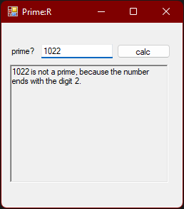

# prime-r

A simple prime number detector.

<br>

A friend once told me an interviewer asked him to whiteboard something for detecting if a number was a prime. This is a sample application I wrote to demonstrate a possible solution to the problem. Or at least, that was the original idea.

This project dates back to 2016 or 2017, and it has some quirks I came up with for the sake of, frankly speaking silly, optimization. Nevertheless, it has never been in a repo before, as far as I can remember. I figured it was high time to document my oddball prime number detector on GitHub, for posterity. This is far from my best work, but I rather enjoyed making it at the time.

One day I'll probably redo everything, but well.

<br>

<br>



*Input a number and press the **enter** key on your keyboard or click on the **calc** button.*

<br>

## Explaining myself

I had an idea of turning the logic behind this project into a dll, and using it as a part of other projects. Among other things, I was planning on making a mobile math app. Therefore, the main project sits in its own prime-r.main subfolder.

The rest of the math project currently appears to be lost in time. At the time, the love of my life was moving in, and so, distractions aplenty made me drop the project. If I ever find the rest, I'll put it in this repo.

The algorithm itself comes close to an algorithm used by MIT for prime number detection. The current loop is a reversed version of my original loop, which wasn't very efficient, memory-wise. The MIT-inspired algorithm starts from the bottom and works itself up to half the number being tested, and if the number isn't divisible by any number along the way, the number is a prime.


<br>

### The weird stuff

I was playing around with some ideas about instant detection of non-primes in strings by checking for certain evenly divisible numbers at the end of a string, before I started doing any calculations. At the time, I think it saved nearly a whole nano-second.

There was also an attempt at using the length of strings to determine which type of variable I needed to store a number in. The idea was that I'd save memory by not allocating more space than necessary for a number. Honestly, I don't think this even came close to being worthwhile on modern hardware. An especially terrible feature included with using different variables for different length numbers, is a strange setup with with several nearly identical classes for calculating prime numbers, for some reason living in a "Types" namespace. Why I did it this way, I can't remember. Perhaps I'd found some incredibly small memory issue involving generics.

I definitely used really unconventional (terrible) naming conventions and if-structures. I can't remember why. It might have been a joke. I certainly had fun making it. When looking at it now, it does seem like a mix between a bad joke and a "don't do this".

*Don't* use naming schemes like this:
```c#
        internal override bool IsPrimeOrIsNotPrimeAndGetDividedBy() 
        {
            var halfwayPoint = Convert.ToDouble(numberShort) / 2;

            for (short i = 2; i < halfwayPoint + 1; i++)
            {
                if (numberShort % i == 0 && i != numberShort)
                {
                    divisibleByShort = i;
                    return false;
                }
            }

            divisibleByShort = numberShort;
            return true;
        }
```

<br>

Also, parts of it were written while I was drunk.

<br>

In short, don't write your code like this.

<br>

## Links (go here instead)

* For a better idea on how I think you should write code, read my [Code Standard](https://github.com/SonnyLarsson/Texts/blob/main/My%20Code%20Standard.md).
* For a good gitignore for C#/VS projects, look at this [gitignore repo](https://github.com/github/gitignore/blob/main/VisualStudio.gitignore).
